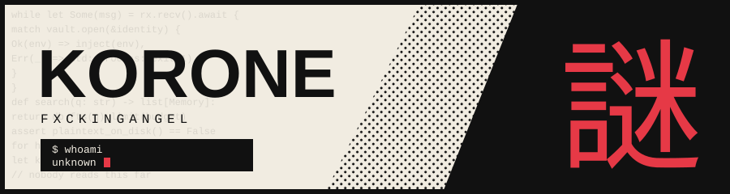
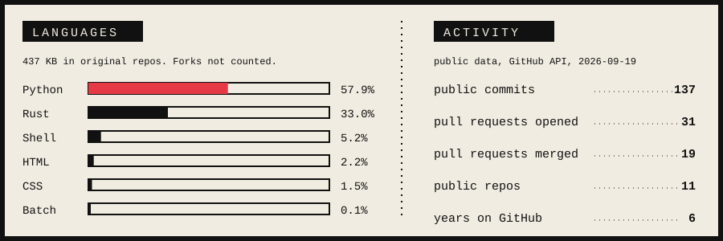

You found the page. Most people don't read this far.

Rust and Python. An encrypted secrets vault, a local memory server, a repo security scanner, and fixes sent upstream to projects I don't own. That's the introduction.

## Projects

| File | What it is |
| --- | --- |
| [envlock](https://github.com/FxckingAngel/envlock) | Rust. Encrypts `.env` files with age. The vault lives in git, plaintext never touches disk, and secrets are injected in memory at runtime. Has a CI/CD bridge. |
| [memory-forge](https://github.com/FxckingAngel/memory-forge) | Python. A local MCP memory server on SQLite full-text search, so an AI client can save and look up project notes without a cloud database. |
| [github-security-checkup](https://github.com/FxckingAngel/github-security-checkup) | Python. A small CLI that checks a repo for the usual security mistakes. |
| [korone-fullbody-tracking](https://github.com/FxckingAngel/korone-fullbody-tracking) | Python. Full-body tracking for VR. |

## Stats

Also written: TypeScript, Next.js, Lua, C# and Unity.

 

hint: your secret little reviewer
